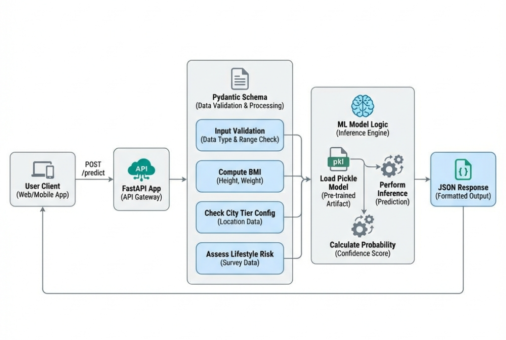

# Insurance Premium Prediction API

Rethinking insurance pricing with AI. This FastAPI-based application predicts insurance premium categories based on personal demographics and health metrics. It features a robust, modular architecture designed for production readiness.

---

## Key Features

-   **Modular Design**: Clean separation of concerns between Schema (Validation), Model (Inference), and Config.
-   **Robust Validation**: Uses **Pydantic** for strict type checking and custom field validators.
-   **Automated Feature Engineering**: Calculates BMI, assigns City Tiers, and determines Lifestyle Risk on-the-fly.
-   **Confidence Scoring**: Returns prediction confidence probabilities for better decision-making.
-   **Ready for Production**: Exception handling, health checks, and standardized API responses.

---

## Project Structure

A clean, hierarchical structure ensures maintainability and scalability.

```text
Insurance-premium-prediction-fastapi/
│
├── config/                 # Configuration & Static Data
│   └── city_tier.py        # City tier categorizations (Tier 1 vs Tier 2/3)
│
├── model/                  # Machine Learning Core
│   ├── model.pkl           # Pre-trained ML Model (Pickle file)
│   └── predict.py          # Inference logic & probability calculation
│
├── schema/                 # Data Validation & Pydantic Models
│   ├── user_input.py       # Request model with custom validators & computed fields
│   └── prediction_response.py # Response schema definition
│
├── app.py                  # Main FastAPI Application entry point
├── requirements.txt        # Project dependencies
├── Dockerfile              # Containerization setup
└── README.md               # Project documentation
```

---

## System Architecture

The following diagram illustrates the data flow from the user's request to the final prediction response.



---

## Workflow Breakdown

1.  **Request Handling**:
    The client sends a `POST` request to `/predict` with raw user data (Age, Height, Weight, Income, etc.).

2.  **Schema Validation (`schema/user_input.py`)**:
    -   **Validation**: Checks if data types are correct (e.g., `age` is an integer, `weight` is a float).
    -   **Normalization**: The `city` field is auto-formatted (e.g., "mumbai " -> "Mumbai").
    -   **Computed Fields**:
        -   **BMI**: Calculated as $Weight(kg) / Height(m)^2$.
        -   **Age Group**: User is categorized as Young/Adult/Senior based on age thresholds.
        -   **City Tier**: Cities are mapped to numeric tiers (1, 2, 3) using `config/city_tier.py`.
        -   **Lifestyle Risk**: A risk flag (High/Medium/Low) is derived from BMI and smoking status.

3.  **Model Inference (`model/predict.py`)**:
    -   The processed feature dictionary is converted into a Pandas DataFrame.
    -   The pre-loaded **Scikit-Learn** model predicts the most likely premium category.
    -   **Probability Calculation**: The model's `predict_proba()` method returns probabilities for all classes. The highest probability becomes the **Confidence Score**.

4.  **Response Generation**:
    -   The application constructs a JSON response containing the `predicted_category`, `confidence`, and `class_probabilities`.

---

## API Reference

### Endpoint: Predict Premium

-   **URL**: `/predict`
-   **Method**: `POST`

#### Request Body Example
```json
{
  "age": 30,
  "weight": 70,
  "height": 1.75,
  "income_lpa": 15.5,
  "smoker": false,
  "city": "Mumbai",
  "occupation": "private_job"
}
```

#### Response Body Example
```json
{
  "predicted_category": "Premium",
  "confidence": 0.85,
  "class_probabilities": {
    "Basic": 0.05,
    "Standard": 0.10,
    "Premium": 0.85
  }
}
```

---

## Setup & Installation

1.  **Clone the Repository**
    ```bash
    git clone <repository_url>
    cd Insurance-premium-prediction-fastapi
    ```

2.  **Install Dependencies**
    ```bash
    pip install -r requirements.txt
    ```

3.  **Run the Server**
    ```bash
    uvicorn app:app --reload
    ```
    The app will start at `http://127.0.0.1:8000`.

4.  **Documentation (Swagger UI)**
    Visit `http://127.0.0.1:8000/docs` to test endpoints interactively.
